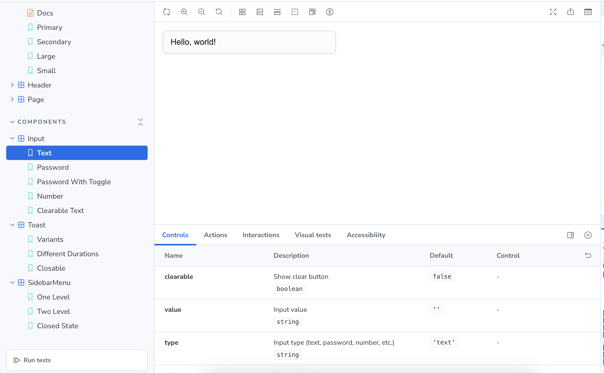
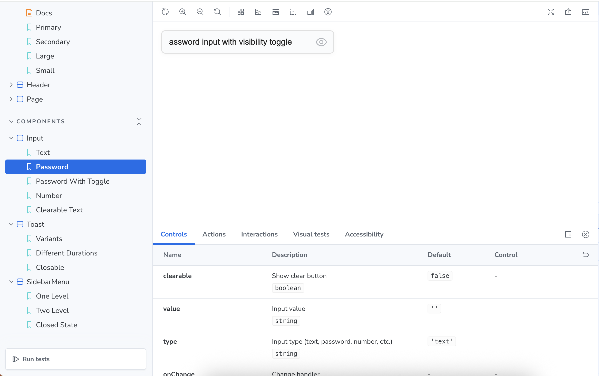
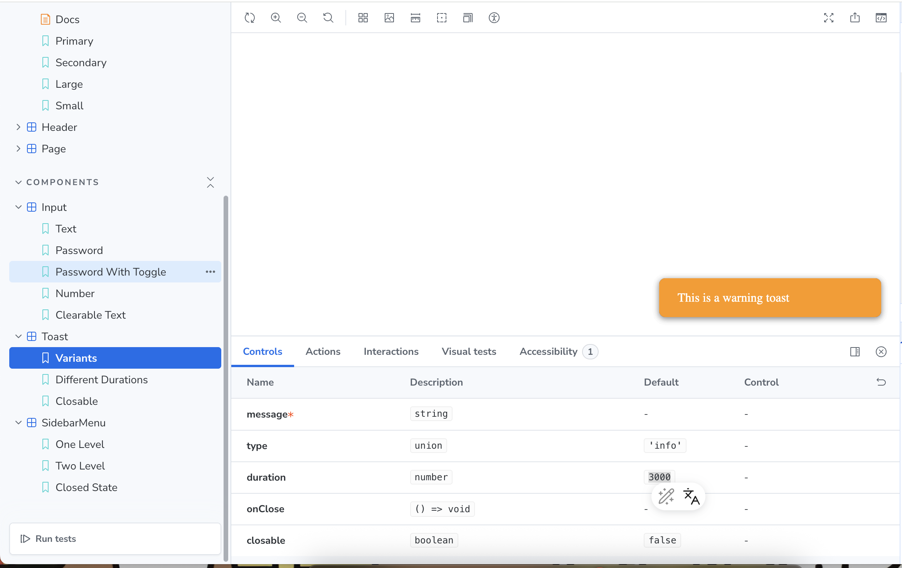
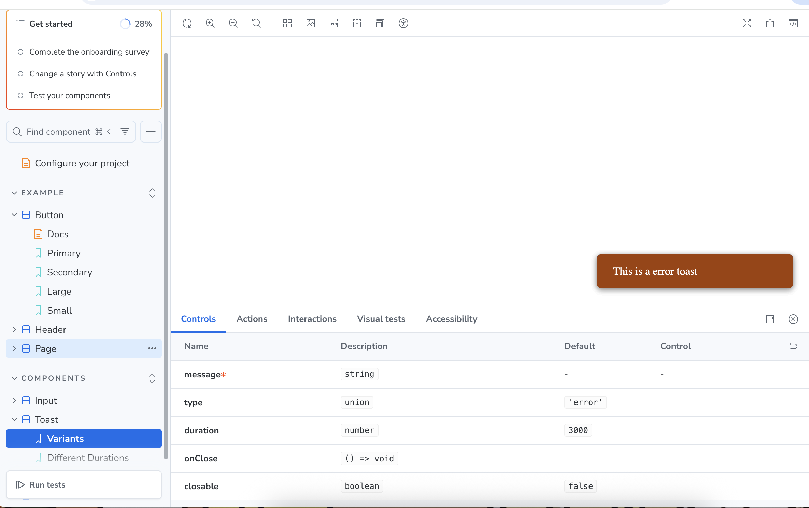
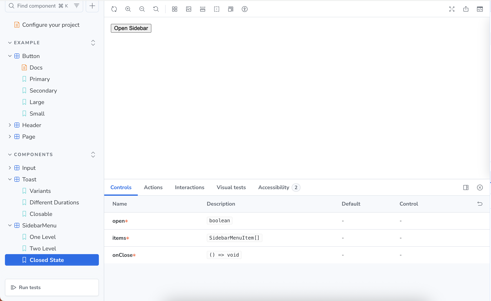
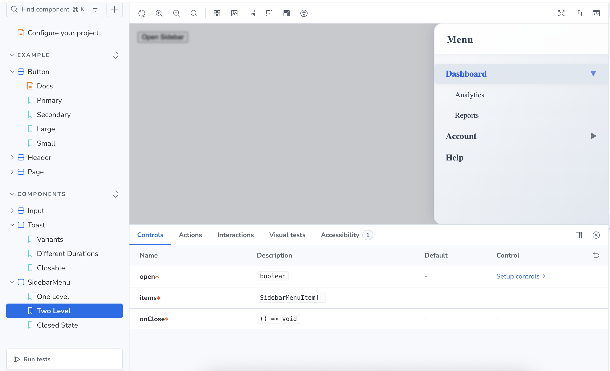
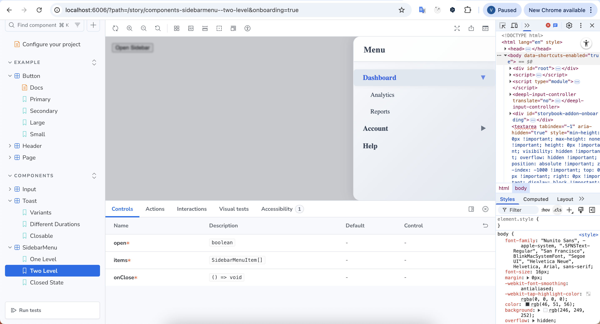

# React Component Library (Storybook)

This project is a small reusable React component library built with TypeScript and Storybook.
It demonstrates component-driven development, clean architecture, and visual documentation.

## 🛠 Tech Stack

- React
- TypeScript
- Storybook
- Vite (or CRA / Next.js — specify what you used)
- CSS / CSS Modules
- ESLint + Prettier

## 🚀 Getting Started

Install dependencies:

```bash
npm install

npm run storybook

Storybook will be available at:
http://localhost:6006

## 4️ Components 

###  Input Component


A reusable input component that supports multiple types and additional controls.

### Features
- Supports text, password and number types
- Password visibility toggle
- Optional clear button
- Controlled via props

### Screenshots

**Text input**


**Password input with visibility toggle**


##  Toast

A notification component used for feedback messages.

### Features
- Appears in bottom-right corner
- Auto-dismiss after specified duration
- Optional manual close button
- Smooth enter/exit animation

### Screenshots

**Warning toast**


**Error toast**


## Sidebar Menu

A sliding sidebar navigation component with nested menu items.

### Features
- Slides in from the right
- Supports nested submenus
- Closes when clicking outside
- Controlled open/close state

### Screenshots
**Closed state**


**Open state with nested menu**


## Storybook Overview

All components are documented and demonstrated using Storybook.
Each component includes multiple states and variations.



## Project Structure

```
test-assessment/
├── public/
├── src/
│   ├── components/
│   │   ├── Input.tsx
│   │   ├── Input.module.css
│   │   ├── Input.stories.tsx
│   │   ├── Toast.tsx
│   │   ├── Toast.stories.tsx
│   │   ├── SidebarMenu.tsx
│   │   ├── SidebarMenu.stories.tsx
│   ├── pages/
│   │   ├── _app.tsx
│   │   ├── _document.tsx
│   │   ├── index.tsx
│   │   └── api/
│   │       └── hello.ts
│   └── styles/
│       └── globals.css
├── .storybook/
│   ├── main.ts
│   └── ...
├── screenshots/
│   └── (your screenshots here)
├── package.json
├── tsconfig.json
├── postcss.config.mjs
├── eslint.config.mjs
├── next.config.ts
├── README.md
└── ...
```


